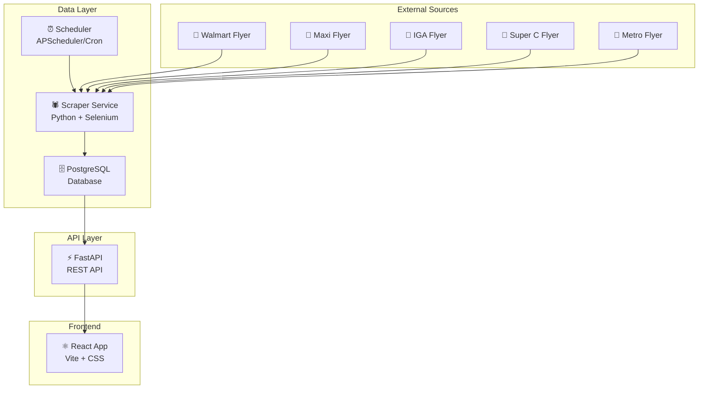

# 🛒 GrocerySaver — Grocery Price Comparison Platform

A full-stack web application that scrapes weekly grocery flyer data from Canadian retailers and lets users compare prices across stores for any product.

## Project Overview

**Goal:** User searches for a product (e.g., "tomato") → App displays prices from multiple stores → Highlights the lowest price.

**Target Market:** Canadian shoppers (Quebec focus: Maxi, Walmart, IGA, Super C, Metro)

**Tech Stack:**
| Layer | Technology |
|-------|-----------|
| **Scraper** | Python + Selenium + BeautifulSoup |
| **Backend API** | Python (FastAPI) |
| **Database** | PostgreSQL |
| **Frontend** | React (Vite) |
| **Scheduling** | APScheduler / Cron |

---

## Architecture



---

## Proposed Changes

### Phase 1: Project Setup & Database Design (Day 1-2)

#### [NEW] Project structure

```
SAVING/
├── backend/
│   ├── app/
│   │   ├── __init__.py
│   │   ├── main.py              # FastAPI entry point
│   │   ├── config.py            # Environment config
│   │   ├── database.py          # DB connection & session
│   │   ├── models.py            # SQLAlchemy models
│   │   ├── schemas.py           # Pydantic schemas
│   │   ├── routers/
│   │   │   ├── __init__.py
│   │   │   ├── products.py      # Product search endpoints
│   │   │   ├── stores.py        # Store endpoints
│   │   │   └── prices.py        # Price comparison endpoints
│   │   └── services/
│   │       ├── __init__.py
│   │       ├── search.py        # Search & fuzzy matching logic
│   │       └── price_compare.py # Price comparison logic
│   ├── requirements.txt
│   ├── .env.example
│   └── alembic/                 # DB migrations
│       └── ...
├── scraper/
│   ├── __init__.py
│   ├── main.py                  # Scraper entry point
│   ├── config.py                # Scraper config
│   ├── base_scraper.py          # Abstract base scraper class
│   ├── stores/
│   │   ├── __init__.py
│   │   ├── walmart.py           # Walmart scraper
│   │   ├── maxi.py              # Maxi scraper
│   │   ├── iga.py               # IGA scraper
│   │   ├── superc.py            # Super C scraper
│   │   └── metro.py             # Metro scraper
│   ├── utils/
│   │   ├── __init__.py
│   │   ├── parser.py            # Price parsing utilities
│   │   ├── normalizer.py        # Product name normalization
│   │   └── db_writer.py         # Database insertion logic
│   ├── scheduler.py             # APScheduler weekly jobs
│   └── requirements.txt
├── frontend/
│   ├── src/
│   │   ├── components/
│   │   │   ├── SearchBar.jsx
│   │   │   ├── ProductCard.jsx
│   │   │   ├── PriceComparison.jsx
│   │   │   ├── StoreFilter.jsx
│   │   │   ├── PriceHistory.jsx
│   │   │   └── Navbar.jsx
│   │   ├── pages/
│   │   │   ├── Home.jsx
│   │   │   ├── SearchResults.jsx
│   │   │   └── About.jsx
│   │   ├── services/
│   │   │   └── api.js           # API client
│   │   ├── App.jsx
│   │   ├── main.jsx
│   │   └── index.css
│   ├── package.json
│   └── vite.config.js
├── docker-compose.yml           # PostgreSQL + app containers
├── .gitignore
└── README.md
```

---

#### [NEW] Database Schema

```sql
-- Stores table
CREATE TABLE stores (
    id SERIAL PRIMARY KEY,
    name VARCHAR(100) NOT NULL UNIQUE,    -- e.g., 'Walmart', 'Maxi'
    slug VARCHAR(100) NOT NULL UNIQUE,    -- e.g., 'walmart', 'maxi'
    logo_url VARCHAR(500),
    website_url VARCHAR(500),
    flyer_url VARCHAR(500),               -- URL to scrape
    created_at TIMESTAMP DEFAULT NOW()
);

-- Flyers table (tracks each weekly flyer)
CREATE TABLE flyers (
    id SERIAL PRIMARY KEY,
    store_id INTEGER REFERENCES stores(id),
    start_date DATE NOT NULL,
    end_date DATE NOT NULL,
    scraped_at TIMESTAMP DEFAULT NOW(),
    status VARCHAR(20) DEFAULT 'active',  -- 'active', 'expired'
    UNIQUE(store_id, start_date, end_date)
);

-- Products table (normalized product entries)
CREATE TABLE products (
    id SERIAL PRIMARY KEY,
    raw_name VARCHAR(500) NOT NULL,           -- Original name from flyer
    normalized_name VARCHAR(500),             -- Cleaned/normalized name
    category VARCHAR(100),                    -- e.g., 'produce', 'dairy', 'meat'
    brand VARCHAR(200),
    created_at TIMESTAMP DEFAULT NOW()
);

-- Prices table (the core: links products to stores with prices)
CREATE TABLE prices (
    id SERIAL PRIMARY KEY,
    product_id INTEGER REFERENCES products(id),
    store_id INTEGER REFERENCES stores(id),
    flyer_id INTEGER REFERENCES flyers(id),
    current_price DECIMAL(10, 2) NOT NULL,
    original_price DECIMAL(10, 2),            -- Before discount
    savings VARCHAR(100),                     -- e.g., "Save $2.00"
    unit VARCHAR(50),                         -- e.g., "per lb", "each", "per kg"
    quantity VARCHAR(100),                    -- e.g., "2 for $5"
    description TEXT,
    image_url VARCHAR(500),
    valid_from DATE,
    valid_until DATE,
    scraped_at TIMESTAMP DEFAULT NOW(),
    UNIQUE(product_id, store_id, flyer_id)
);

-- Full-text search index
CREATE INDEX idx_products_search ON products 
    USING GIN (to_tsvector('english', normalized_name));

-- Price lookup indexes
CREATE INDEX idx_prices_product_id ON prices(product_id);
CREATE INDEX idx_prices_store_id ON prices(store_id);
CREATE INDEX idx_prices_valid_until ON prices(valid_until);
```

> [!IMPORTANT]
> PostgreSQL is chosen specifically for its excellent full-text search (via `tsvector`/`tsquery`) and `pg_trgm` fuzzy matching extension — critical for matching user queries like "tomato" to flyer entries like "Tomatoes on the vine, 1lb" or "Tomates grappe".

---

### Phase 2: Scraper Development (Day 3-7)

This is the most critical and challenging phase. Based on research of the [flipp_flyer_parser](https://github.com/FriendlyUser/flipp_flyer_parser) and the [Medium article](https://dlcoder.medium.com/automated-data-extraction-from-online-retail-flyers-using-python-and-selenium-d9a71288b974), here is the approach:

#### Data Acquisition Strategy

> [!WARNING]
> **Flipp does NOT have a public API.** All data acquisition will use Selenium-based browser automation to scrape flyer pages. This is acceptable for a personal/portfolio project but would need data partnerships for commercial use.

**Approach: Selenium + BeautifulSoup (inspired by `flipp_flyer_parser`)**

Most Canadian grocery stores embed their flyers using the **Flipp iframe widget** on their websites. The scraper will:

1. Navigate to each store's flyer page using `undetected-chromedriver`
2. Wait for the Flipp iframe to load
3. Switch into the iframe context
4. Extract product items (name, price, description, dates, images)
5. Parse and normalize the data
6. Store in PostgreSQL

#### [NEW] `scraper/base_scraper.py` — Abstract base class

```python
from abc import ABC, abstractmethod

class BaseScraper(ABC):
    """Base class for all store scrapers."""
    
    def __init__(self, store_name: str, store_slug: str, flyer_url: str):
        self.store_name = store_name
        self.store_slug = store_slug
        self.flyer_url = flyer_url
        self.driver = None
    
    @abstractmethod
    def setup_driver(self):
        """Initialize and configure the Selenium driver."""
        pass
    
    @abstractmethod
    def navigate_to_flyer(self):
        """Navigate to the store's flyer page and handle any popups/location prompts."""
        pass
    
    @abstractmethod
    def extract_products(self) -> list[dict]:
        """Extract all products from the current flyer. Returns list of product dicts."""
        pass
    
    def scrape(self) -> list[dict]:
        """Main scrape workflow."""
        self.setup_driver()
        self.navigate_to_flyer()
        products = self.extract_products()
        self.cleanup()
        return products
    
    def cleanup(self):
        if self.driver:
            self.driver.quit()
```

#### [NEW] `scraper/stores/walmart.py` — Example store scraper

Each store scraper inherits from `BaseScraper` and implements store-specific logic:
- **Walmart**: `https://www.walmart.ca/flyer` → Uses Flipp iframe
- **Maxi**: `https://www.maxi.ca/en/flyer` → Uses Flipp iframe  
- **IGA**: `https://www.iga.net/en/flyer` → Custom flyer system
- **Super C**: `https://www.superc.ca/en/flyer` → Uses Flipp iframe
- **Metro**: `https://www.metro.ca/en/flyer` → Custom flyer system

#### [NEW] `scraper/utils/normalizer.py` — Product name normalization

This is critical for cross-store matching:

```python
import re
from unidecode import unidecode

def normalize_product_name(raw_name: str) -> str:
    """
    Normalize product names for cross-store matching.
    'Tomates grappe bio' → 'tomato vine organic'
    'Vine Tomatoes, 1lb' → 'tomato vine'
    """
    name = raw_name.lower()
    name = unidecode(name)           # Remove accents (é → e)
    name = re.sub(r'\d+\s*(lb|kg|g|ml|oz|l)\b', '', name)  # Remove units
    name = re.sub(r'[^\w\s]', '', name)  # Remove punctuation
    name = ' '.join(name.split())    # Normalize whitespace
    return name
```

#### Key Scraper Dependencies

```
undetected-chromedriver    # Bypass bot detection
selenium                   # Browser automation
beautifulsoup4             # HTML parsing
python-dotenv              # Environment variables
psycopg2-binary            # PostgreSQL driver
sqlalchemy                 # ORM
apscheduler                # Job scheduling
unidecode                  # Accent removal for French text
python-dateutil            # Date parsing
```

---

### Phase 3: Backend API (Day 8-11)

#### [NEW] `backend/app/main.py` — FastAPI application

Core endpoints:

| Method | Endpoint | Description |
|--------|----------|-------------|
| `GET` | `/api/search?q=tomato` | Search products across all stores |
| `GET` | `/api/products/{id}/prices` | Get all store prices for a product |
| `GET` | `/api/stores` | List all tracked stores |
| `GET` | `/api/deals` | Get top deals across all stores |
| `GET` | `/api/compare?products=1,2,3` | Compare specific products |
| `GET` | `/api/history/{product_id}` | Price history for a product |

#### Search Logic (the secret sauce)

The search endpoint will use PostgreSQL's powerful text search:

```python
# 1. Full-text search with ranking
SELECT p.*, pr.current_price, s.name as store_name
FROM products p
JOIN prices pr ON p.id = pr.product_id
JOIN stores s ON pr.store_id = s.id
WHERE 
    to_tsvector('english', p.normalized_name) @@ plainto_tsquery('english', :query)
    AND pr.valid_until >= CURRENT_DATE
ORDER BY 
    ts_rank(to_tsvector('english', p.normalized_name), plainto_tsquery(:query)) DESC,
    pr.current_price ASC;

# 2. Fallback: Trigram similarity for fuzzy matches
SELECT p.*, similarity(p.normalized_name, :query) as sim
FROM products p
WHERE p.normalized_name % :query  -- trigram similarity > 0.3
ORDER BY sim DESC;
```

#### Key Backend Dependencies

```
fastapi                    # Web framework
uvicorn                    # ASGI server
sqlalchemy                 # ORM
psycopg2-binary            # PostgreSQL
pydantic                   # Data validation
python-dotenv              # Config
alembic                    # DB migrations
```

---

### Phase 4: React Frontend (Day 12-18)

#### UI Design Concept

The frontend will be a modern, responsive web app with:

1. **Landing Page** — Hero section with a prominent search bar, "How it works" section, featured deals
2. **Search Results Page** — Grid of product cards grouped by product, sorted by price. Lowest price highlighted with a green badge.
3. **Product Detail** — Full price comparison table, price history chart, store links

#### Key Components

| Component | Purpose |
|-----------|---------|
| `SearchBar` | Autocomplete search with debounced API calls |
| `PriceComparison` | Side-by-side store prices with lowest highlighted |
| `ProductCard` | Product thumbnail, name, price, store badge |
| `StoreFilter` | Toggle stores to include/exclude |
| `PriceHistory` | Line chart showing price over time (Chart.js) |
| `DealCarousel` | Scrollable featured deals on landing page |

#### Frontend Dependencies

```
react-router-dom           # Routing
axios                      # API calls
chart.js + react-chartjs-2 # Price history charts
react-icons                # Store icons
```

---

### Phase 5: Integration & Deployment (Day 19-21)

#### Docker Setup

```yaml
# docker-compose.yml
services:
  db:
    image: postgres:16
    environment:
      POSTGRES_DB: grocerysaver
      POSTGRES_USER: admin
      POSTGRES_PASSWORD: ${DB_PASSWORD}
    ports:
      - "5432:5432"
    volumes:
      - pgdata:/var/lib/postgresql/data

  backend:
    build: ./backend
    ports:
      - "8000:8000"
    depends_on:
      - db
    env_file: .env

  scraper:
    build: ./scraper
    depends_on:
      - db
    env_file: .env

  frontend:
    build: ./frontend
    ports:
      - "3000:3000"
    depends_on:
      - backend
```

---

## Open Questions

> [!IMPORTANT]
> **Store Selection:** Which stores do you want to prioritize? I'd recommend starting with **3 stores** for the MVP:
> - **Walmart** (has Flipp iframe, widely used)
> - **Maxi** (Quebec-specific, Flipp iframe)
> - **Metro** or **IGA** (Quebec-specific)
> 
> Adding more stores later is straightforward since we're using a modular scraper design.

> [!IMPORTANT]
> **Location:** Should the app be postal-code specific? Flyer prices can vary by location/store. For MVP, we could hardcode a single location (e.g., Montreal area) and add location selection later.

> [!IMPORTANT]
> **Deployment:** For your resume, do you want this deployed publicly (e.g., on Railway/Render + Vercel) or just running locally with a good README and demo screenshots/video?

> [!IMPORTANT]
> **Project Name:** Do you have a name in mind? Some ideas:
> - **GrocerySaver** 
> - **PriceScout**
> - **DealDash**
> - **FlyerFinder**

---

## Resume Impact — Key Technical Highlights

This project demonstrates impressive skills for a resume:

| Skill | How It's Demonstrated |
|-------|----------------------|
| **Web Scraping** | Selenium + undetected-chromedriver, handling iframes, anti-bot measures |
| **Data Engineering** | ETL pipeline, data normalization, bilingual text processing |
| **Full-Stack Development** | React frontend + FastAPI backend + PostgreSQL |
| **Database Design** | Schema design, full-text search, indexing, migrations |
| **NLP / Text Processing** | Fuzzy matching, product name normalization, French/English handling |
| **DevOps** | Docker, cron scheduling, environment management |
| **API Design** | RESTful API design, query optimization |

---

## Verification Plan

### Automated Tests
- `pytest` for backend API endpoints
- `pytest` for scraper unit tests (mocked HTML)
- React component tests with Vitest

### Manual Verification
- Run scrapers against live store pages and verify data extraction
- Search for common products and verify cross-store comparison
- Test with French product names (e.g., "tomate", "pomme")
- Verify price highlighting (lowest price is correctly identified)

---

## Estimated Timeline

| Phase | Duration | Deliverable |
|-------|----------|-------------|
| Phase 1: Setup & DB | 2 days | Project structure, database, Docker |
| Phase 2: Scraper | 5 days | Working scrapers for 3 stores |
| Phase 3: Backend API | 4 days | FastAPI with search & compare endpoints |
| Phase 4: Frontend | 7 days | Full React UI with search, compare, history |
| Phase 5: Polish | 3 days | Docker, tests, README, deploy |
| **Total** | **~3 weeks** | **Full working platform** |
